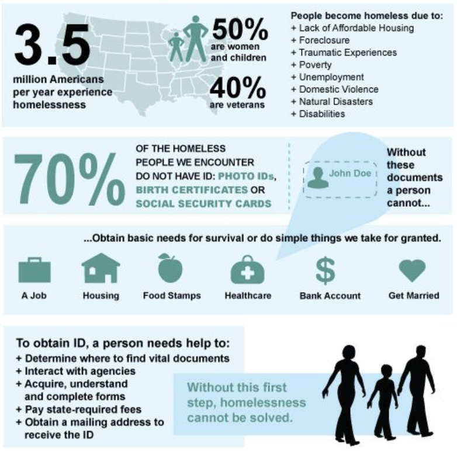
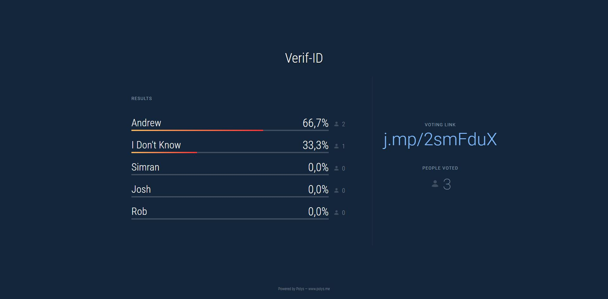

# VerifID  🎫

 A Hyperledger fabric based dApp that allows the homeless people around greater vancouver area to have digital identities. 
 

# Inspiration 💡
Without credible identification, basic necesseties are difficult to access.

Homeless population is severely affected.

# What does the dApp do?
Using a dApp vouching system to verify a person's legitimacy, we can crowd-source their referalls and speed up the verification process!

- Everyone helps in the verification process, simultaneously increasing their own credibility and being rewarded
- Engages the community and facilitates trust building

 
# Team Members

- Danielle Batista
- Joshua Di
- Andrew Lui
- Rob McDougall
- Simran Sethi